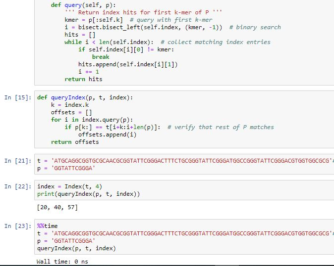

# Research-Paper-Genome-Sequencing-and-Analysis-of-Cancer-Codons

## Complete Implementation of Various Algorithms related to Bioinformatics,which helped in successful paper presentation in RTEICT-2019.

**First Author**: SHAILESH DHAMA

**Co-Authors** : Prof.Anooja Ali; Prof.Vishwanath Hulipalled

### Description

Genome Sequencing in the field of Bioinformatics is quite an evolving application as all the information of an organism is carried on its DNA.

Sequencing and Analysis of genome helps in rapid clinical diagnosis and treatment of diseases and advanced scientific research.

In this paper, We increase the efficiency of finding mutations with primary techniques namely, indexing, pattern matching, sequence alignments and comparison of FASTA files to find out variation, leading to the increase in accuracy of finding cancer genome mutation.


### Data
DATASET OBTAINED FROM THIS WEBSITE → https://www.ncbi.nlm.nih.gov/--


## Steps:
- Data Preprocessing.
- Pattern Matching Techniques on dataset.
- Sequence Alignment Techniques on dataset.
- Precise Detection of mutated codons from dataset.

## Results

#### Data Preprocessing




#### Visual 2

> Sentence about visualization.


> Sentence about visualization.

## Recommendations:

More of your own text here


## Limitations & Next Steps

More of your own text here


### For further information

Please review the narrative of our analysis in [our jupyter notebook](./PROJECT-FINAL.ipynb) or review our [presentation](./PAPER ID--449.pptx)

For any additional questions, please contact **shaileshshettyd@gmail.com)


##### Repository Structure:

Here is where you would describe the structure of your repoistory and its contents, for example:

```

├── README.md                                           <- The top-level README for reviewers of this project.
├── A3 BATCH--FINAL REPORT.pdf                          <- Narrative documentation of analysis in pdf.
├── Genome Sequencing and Analysis of Cancer Codons.pdf <- Submitted International paper. 
├── PAPER ID--449.pptx                                  <- project presentation.
├── PAPER IMPLEMENTATION                                <- Paper Implementation Notebook on Cervical Cancer Dataset. 
    └── 1DNA Sequencing Analysis.ipynb
    └── 2PREPROCESSING.ipynb
    └── 3APPROXIMATE MATCHING.ipynb
    └── 4NAIVE.ipynb
    └── 5ALIGNMENT.ipynb
    └── 6FINAL RESULTS.ipynb
    └── PROJECT-FINAL.ipynb
├── CERVICAL CANCER RESULTS                             <- both sourced externally and generated from code.
    └── 1.PreProcessing
    └── 2.Pattern Matching
    └── 3.Sequence Alignment
    └── 4.RESULTS                                         
```
## Citing

```
@misc{Shailesh:2019,
  Author = {Shailesh Dhama},
  Title = {Research-Paper-Genome-Sequencing-and-Analysis-of-Cancer-Codons},
  Year = {2019},
  Publisher = {GitHub},
  Journal = {GitHub repository},
  Howpublished = {\url{https://github.com/ShaileshDhama/Research-Paper-Genome-Sequencing-and-Analysis-of-Cancer-Codons}}
}
```
